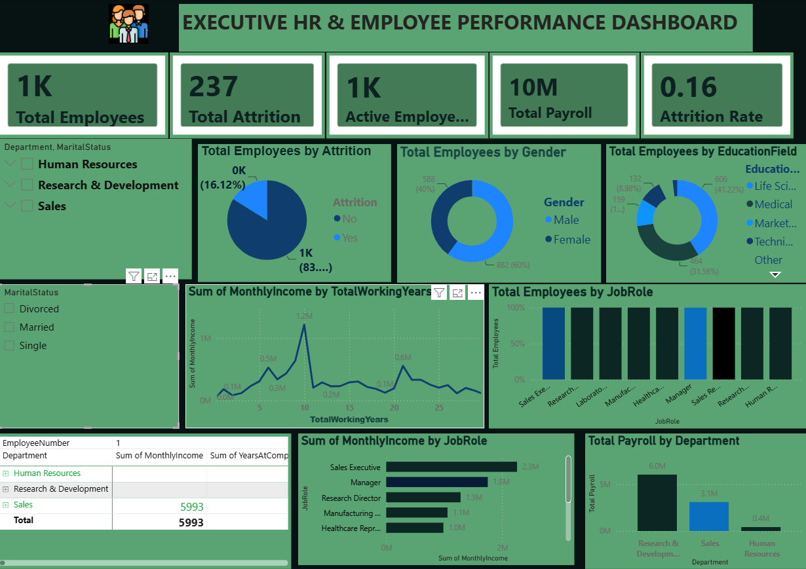

# Executive HR & Employee Performance Dashboard

An interactive and comprehensive Power BI dashboard designed to analyze workforce dynamics, employee performance, attrition trends, and compensation structures.



## 📌 Project Overview
This project provides actionable HR insights to help decision-makers understand employee turnover, monitor payroll allocation, and optimize overall workforce management.

## 📊 Key Features & Visualizations
* **KPI Summary Cards:** Tracks Total Employees, Active Employees, Attrition Count, Total Payroll, and Attrition Rate at a glance[cite: 13].
* **Attrition Analysis:** Breaks down employee turnover by Gender, Department, and Education Field[cite: 13].
* **Payroll & Tenure Insights:** Analyzes salary distribution (`MonthlyIncome` / `Total Payroll`) against years of experience (`TotalWorkingYears`)[cite: 13, 14].
* **Job Role Breakdown:** Itemizes employee count and monthly income across various organizational roles[cite: 13, 14].
* **Interactive Slicers:** Allows seamless data filtering by Department and Marital Status[cite: 13].

## 🛠️ Tools & Technologies Used
* **Power BI Desktop:** Data Modeling, DAX, Visual Design, and Dashboard Creation
* **Data Source:** HR Employee Performance Dataset

## 📁 Repository Structure
```text
├── Emplyee3 Dashboard.png        # Dashboard Screenshot
├── Employee_Performance.pbix     # Power BI Project File (Upload your .pbix file here)
└── README.md                     # Project Documentation 
